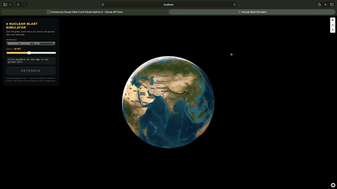

# ☢️ Nuclear Blast Simulator

Spin a 3D satellite globe, zoom into any city, click to set ground zero, pick a
warhead — from the 0.02 kt Davy Crockett to the 50 Mt Tsar Bomba — and **detonate**.



🎬 **[Watch the full demo with sound →](media/demo.mp4)**

## What you get

- 🌍 3D globe with real satellite imagery — no API keys needed
- 💥 Damage rings from real cube-root scaling laws (Glasstone & Dolan, *The Effects of Nuclear Weapons*)
- ☁️ Three.js mushroom cloud at true physical scale — a 1 Mt cloud really towers ~23 km
- 🔊 Fully synthesized blast audio — double-flash, crack, boom, sub-bass, rolling rumble
- 🌊 Expanding shockwave that reveals each damage zone as it passes

## Run it

```bash
npm install
npm run dev
```

Open http://localhost:5173, click a city, press DETONATE.

## Stack

React + Vite · MapLibre GL JS · Three.js · WebAudio

> Built in ~20 minutes by Anthropic's **Fable 5** from a two-line prompt.
> Educational visualization only — radii are ballpark approximations for a surface burst.
